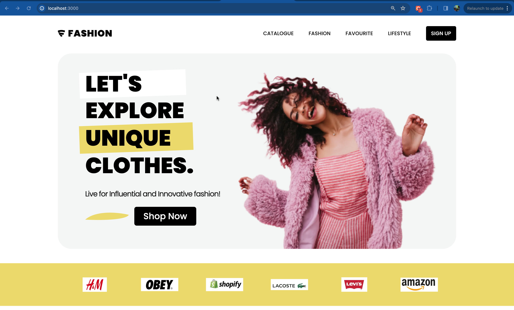

#### FASHION WEBSITE INSTALLATION INSTRUCTIONS

A Basic Fashion website which helps you advertise your brand

## Installation

```bash
git clone https://github.com/DANIEL-THE-PROGRAMMER/fashion-web
npm install
npm run dev
```

## Deployed URL and screenshot

- [Landing page](https://fashion-web-two.vercel.app/)
- 

## Credits and references

1. Project design that inspired me [FIGMA DESIGN](<https://www.figma.com/file/WXPSCs2tc4QmAsygbzc7JF/Shopping-Website-(Community)?node-id=2%3A2&mode=dev>)

## Technologies used

1. Next js 🚀
2. Typescript ❤️
